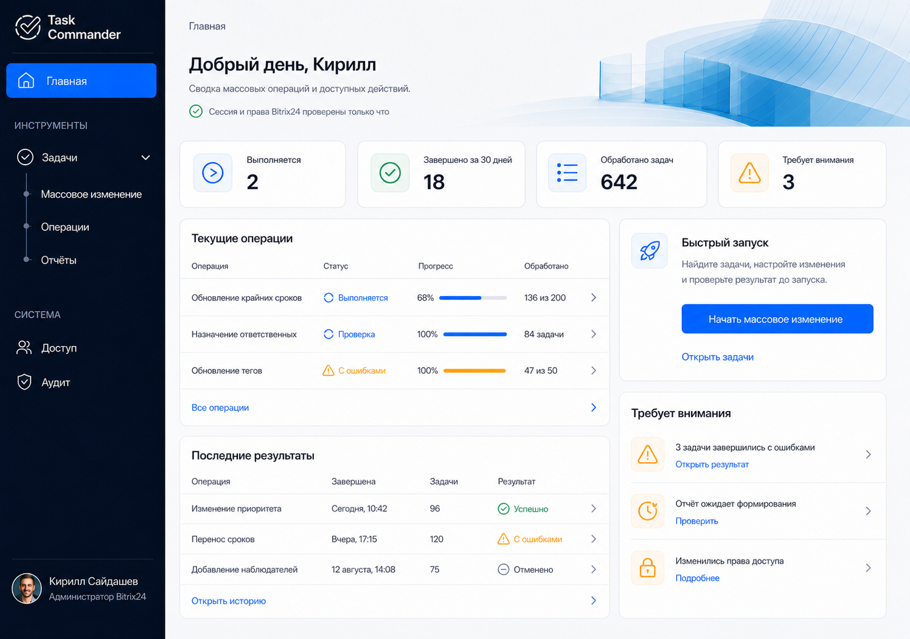

# Задача 013 — технический план реализации

**Статус:** реализуется; проверка ожидает запуска пользователем.  
**Решения:** [утверждены](../docs/decisions/2026-08-14-task-013-app-shell-navigation-decisions.md).

## Утверждённый визуальный ориентир

Пользователь утвердил этот вариант главной страницы как ориентир реализации:



Референс фиксирует структуру: тёмная боковая навигация, короткий статусный hero-блок, карточки
сводки, рабочая колонка операций и правая колонка быстрого запуска. Числа, операции и уведомления
на изображении — демонстрационные: до задач 023, 028 и 029 они не показываются как реальные данные.

План описывает реализацию безопасной русскоязычной desktop-оболочки, session/access boundary,
permission-aware navigation и общих состояний. Он не является командой на изменение кода.

## 1. Целевая архитектура

```text
Viewport / Bitrix context
          ↓
App bootstrap boundary
  GET /api/session
          ↓
  GET /api/access
          ↓
Typed router context ─── QueryClient
          ↓
Protected layout route
          ↓
Route permission guard
          ↓
AppShell + разрешённый экран
```

Основные инварианты:

1. `AppShell` не владеет загрузкой сессии и не может отрисоваться до успешного bootstrap.
2. `/api/session` определяет личность, `/api/access` — эффективные права; оба ответа строго
   валидируются общими Zod-контрактами.
3. Один централизованный policy-модуль отвечает и за пункты меню, и за route guards.
4. Сервер остаётся источником истины. Client guard отвечает только за безопасный UX до вызова API.
5. Query- и mutation-кэш изолируется по identity generation и полностью очищается при смене
   пользователя, портала либо подтверждённом отзыве доступа.
6. Production launch flow не выдумывается в задаче 013: клиент использует существующую сессию, а
   OAuth/iframe bootstrap подключается к этой границе в задаче 035.

## 2. Предлагаемая структура модулей

Точные имена могут быть немного скорректированы при реализации, но ответственность должна остаться
разделённой.

### Новые модули

- `webapp/src/app/query-client.ts` — единый экземпляр и security-sensitive query defaults.
- `webapp/src/app/app-bootstrap.tsx` — машина состояний запуска, восстановления и закрытия доступа.
- `webapp/src/app/session-api.ts` — безопасный GET `/api/session`, классификация ошибок и Zod parsing.
- `webapp/src/app/access-api.ts` — безопасный GET `/api/access` и query options эффективных прав.
- `webapp/src/app/app-context.ts` — типизированный identity/access context для Router.
- `webapp/src/app/access-policy.ts` — чистые predicates видимости маршрутов и действий.
- `webapp/src/app/navigation-model.ts` — декларативное русское меню, feature availability и группы.
- `webapp/src/app/connection-state.tsx` — online/offline, grace period и recovery orchestration.
- `webapp/src/app/cross-tab-access.ts` — безопасный invalidation signal между вкладками.
- `webapp/src/app/route-state.tsx` — loading, forbidden, not-found и route error surfaces.
- `webapp/src/app/focus-manager.tsx` — фокус заголовка после завершённого перехода.
- `webapp/src/app/use-unsaved-changes-blocker.tsx` — общий navigation blocker для dirty-форм.
- `webapp/src/components/ui/app-state.tsx` — общий полноэкранный и локальный state component.

### Основные изменяемые модули

- `webapp/src/main.tsx` — передача QueryClient в typed Router context и правильный порядок providers.
- `webapp/src/app/router.tsx` — pathless protected layout, guards, pending/error/not-found behavior.
- `webapp/src/app/app-shell.tsx` — только presentational shell на уже проверенном контексте.
- `webapp/src/app/viewport-guard.tsx` — три режима ширины и корректное поведение при zoom/resize.
- `webapp/src/locales/ru.ts` — все строки bootstrap, navigation, errors, offline и accessibility.
- `webapp/src/styles.css` — full/compact/unsupported layout, banners, skeletons и focus states.
- существующие access routes — наследование общего guard и подключение dirty-form blocker там, где
  форма уже реализована.

Backend и shared contracts меняются только если при реализации обнаружится реально отсутствующий
безопасный признак. Текущих `sessionResponseSchema`, `effectiveAccessResponseSchema` и
`apiErrorResponseSchema` достаточно для базовой оболочки; клиент не должен расширять их догадками.

## 3. Этап 1 — единый API-клиент и типизированные ошибки

### Реализация

1. Ввести `AppApiError` с безопасными полями: HTTP status, API code, correlation ID и категория:
   `session_required`, `access_denied`, `rate_limited`, `temporary`, `offline`, `invalid_response`,
   `internal`.
2. Для `/api/session` и `/api/access`:
   - отправлять `Accept: application/json`;
   - передавать AbortSignal из TanStack Query;
   - проверять `response.ok` до parsing успешного DTO;
   - безопасно парсить `apiErrorResponseSchema` для ошибки;
   - никогда не превращать non-2xx в `null`;
   - ограничить время бесконечного ожидания и переводить timeout в temporary-state.
3. Настроить retry predicate:
   - не повторять `401`, `403`, revoked и invalid response;
   - один раз повторять network/temporary failures;
   - уважать безопасный `Retry-After` для `429`, если он доступен;
   - после исчерпания повторов показывать ручное действие.
4. Не логировать response bodies, cookie, launch context или permissions в пользовательские ошибки.

### Тесты этапа

- успешный strict parsing session/access;
- `401`, `403`, `429`, `503`, network error, abort/timeout;
- malformed JSON, HTML вместо JSON, неизвестный API error code;
- сохранение correlation ID без раскрытия технических details;
- отсутствие повторов для permanent/security errors.

## 4. Этап 2 — bootstrap state machine и QueryClient boundary

### Состояния

```text
checking_session
checking_access
ready
session_required
access_denied
temporarily_unavailable
offline_initial
offline_grace
offline_blocked
recovering
invalid_response
```

### Реализация

1. Перенести загрузку сессии из `AppShell` в верхнюю bootstrap-границу.
2. Получать access только после подтверждённой session principal.
3. Передавать готовый immutable snapshot `{ principal, permissions, fieldScope, generation }` в
   Router context.
4. Считать приложение `ready` только после обеих успешных проверок.
5. При смене `{ portalId, userId }`:
   - отменить активные queries;
   - очистить query и mutation caches;
   - увеличить identity generation;
   - инвалидировать Router;
   - повторить bootstrap без сохранения старого UI.
6. При подтверждённом отзыве доступа выполнить ту же очистку и перейти в `access_denied`.
7. Session/access queries перепроверять при возврате фокуса во вкладку, не меняя глобальную политику
   остальных продуктовых queries.
8. Использовать `router.invalidate()` после изменения access snapshot, чтобы повторно выполнить
   `beforeLoad` уже открытых маршрутов.

### Тесты этапа

- shell не появляется между session и access responses;
- `null` или stale cache не считается разрешением;
- смена пользователя/портала очищает оба кэша;
- старый response generation отбрасывается;
- grant обновляет context и меню;
- revoke скрывает outlet до повторного рендера закрытого route.

## 5. Этап 3 — централизованная policy-модель

### Route predicates

```text
home        = app_access
tasks       = app_access
operations  = run_bulk_operations OR view_own_reports OR view_all_reports
reports     = view_own_reports OR view_all_reports
access      = manage_access (либо derived Bitrix administrator access)
audit       = view_audit
data        = false in production v1
settings    = false until real settings exist
status      = APP_ENV === local
```

### Реализация

1. Описать predicates чистыми функциями без React и fetch.
2. Выделить отдельно:
   - разрешение войти в route;
   - разрешение показать navigation item;
   - разрешение выполнить действие внутри route.
3. Для tasks оставить route доступным при одном `app_access`; `run_bulk_operations` и field scope
   управляют дальнейшими действиями, а не входом на экран.
4. Для reports право `export_reports` не открывает route само по себе и влияет только на export action.
5. Для access полагаться на актуальный effective access после request-time reconciliation задачи 012;
   не вычислять руководителя на клиенте.
6. Не использовать feature placeholders как доступные production routes.

### Тесты этапа

- табличные тесты всех десяти permissions и значимых комбинаций;
- administrator access;
- `app_access` without run;
- run without report view;
- own/all report visibility;
- export-only malformed combination не открывает reports;
- empty field subset не закрывает tasks;
- local/production feature availability.

## 6. Этап 4 — защищённое дерево TanStack Router

### Реализация

1. Перейти на `createRootRouteWithContext` и передать Router типизированные QueryClient и app context.
2. Создать pathless protected layout для всех продуктовых routes.
3. В его `beforeLoad` гарантировать готовую session/access boundary до рендера `AppShell`.
4. Для каждой ветки routes добавить permission guard из общего policy-модуля. Access workflow routes
   наследуют guard родительской ветки, а admin-repair сохраняет дополнительную серверную проверку.
5. Различать:
   - session/access bootstrap failures — полноэкранные safe states без shell;
   - route permission failure — локальный forbidden-state внутри разрешённой shell;
   - unknown route — 404 с переходом на Главную.
6. Сохранять только относительный internal destination. Не помещать confirmation tokens, launch
   context или иные bearer-данные в redirect search params.
7. Back/Forward и preloaded navigation должны проходить те же guards.
8. Настроить pending state рабочей области и единичную transition-индикацию; повторный клик не должен
   создавать параллельные navigation fetches.

Актуальная документация TanStack Router подтверждает этот путь: typed router context доступен в
`beforeLoad`, а изменение auth/access context должно сопровождаться `router.invalidate()`.

### Тесты этапа

- прямой URL разрешённого и запрещённого route;
- отсутствие вспышки компонента запрещённого route;
- nested access routes не обходят parent guard;
- Back/Forward после revoke;
- deep link после успешного bootstrap;
- deep link с недостаточными правами;
- context-aware 404;
- pending route и двойная навигация.

## 7. Этап 5 — оболочка и декларативная навигация

### Реализация

1. Сделать `AppShell` чистым компонентом, который получает готовый principal/navigation model.
2. Строить меню из единой декларативной структуры, фильтровать items policy-функциями и удалять
   пустые section headings.
3. Сохранить группу «Задачи» при одном дочернем пункте. Раскрыта только группа текущего инструмента.
4. Реализовать group trigger как `<button>` с `aria-expanded`, `aria-controls`, Enter и Space.
5. На Главной реализовать утверждённую dashboard-компоновку из визуального ориентира: greeting и
   подтверждённый статус, quick start, а в будущем — KPI, текущие операции, результаты и внимание.
   До задач 023, 028 и 029 не имитировать операции, числа, результаты или уведомления: вместо них
   показывать честное объяснение, когда эти блоки появятся.
6. Удалить production placeholders «Данные» и «Настройки» из меню. `/status` оставить local-only.
7. Удалить ложный индикатор новых уведомлений и неработающие profile/settings actions.
8. Профиль сделать статическим identity block:
   - полное безопасное имя в доступной подписи;
   - визуальное сокращение длинного имени;
   - fallback «Пользователь Bitrix24»;
   - «Администратор Bitrix24» или «Пользователь», без догадки о руководящем статусе.
9. Предусмотреть общий slot для route transition и будущего operation progress, не подключая данные
   задачи 023 преждевременно.

### Тесты этапа

- menu snapshots/assertions для каждой permission combination;
- отсутствие пустых section headings;
- один разрешённый child внутри стабильной группы;
- корректный active item;
- русские labels;
- длинное и пустое display name;
- корректная нейтральная роль;
- отсутствие ложных notification/settings controls.

## 8. Этап 6 — соединение, восстановление и несколько вкладок

### Реализация

1. Соединить browser online state с фактическим результатом server verification: `navigator.onLine`
   используется как сигнал, а не как доказательство работающего backend.
2. Для первоначального offline показывать full safe state.
3. После потери связи в ready-state:
   - сразу заблокировать mutations и показать один `aria-live` banner;
   - дать короткий grace period, рекомендуемое начальное значение — 5 секунд;
   - после него заменить продуктовый outlet на offline-blocked state;
   - сохранить только зарегистрированное in-memory dirty state.
4. После online event перейти в `recovering`, повторить session/access и вернуть маршрут только для
   той же identity generation и разрешённого route.
5. Ввести `BroadcastChannel` с безопасным сообщением `access-invalidated`; fallback — refetch при focus.
6. После успешной access mutation задачи 011 отправлять только invalidation signal без DTO, field IDs,
   permissions или пользовательских данных.

### Тесты этапа

- initial offline;
- short offline under grace period;
- prolonged offline masks outlet;
- flapping connection создаёт один banner;
- recovery для того же пользователя;
- recovery после смены пользователя или revoke;
- cross-tab invalidation без передачи чувствительных payloads.

## 9. Этап 7 — viewport, фокус и navigation blocking

### Реализация

1. Разделить viewport на режимы:
   - `full`: от 1180px;
   - `compact`: 1024–1179px;
   - `unsupported`: менее 1024px после применения компактной компоновки.
2. В compact-режиме:
   - панель становится icon rail;
   - labels остаются доступными скринридеру;
   - keyboard focus показывает tooltip;
   - рабочая область меняет offset;
   - широкие таблицы скроллятся внутри контента.
3. Боковая панель и workspace получают независимую вертикальную прокрутку для низкого iframe.
4. После успешного route transition фокусировать `h1` или эквивалентный page heading; после
   forbidden/error — heading state component.
5. Добавить `aria-live` для connection, loading и error statuses; цвет никогда не является
   единственным носителем состояния.
6. Реализовать общий dirty-state blocker через актуальный `useBlocker` TanStack Router:
   - custom confirmation dialog для внутренней навигации;
   - `beforeunload` только при dirty-state;
   - отсутствие предупреждения для чистой формы;
   - возможность безопасного принудительного перехода после revoke/session loss.
7. Подключить blocker к уже существующим access forms, не дублируя логику в каждой странице.

### Тесты этапа

- media query transitions full/compact/unsupported;
- увеличение масштаба сначала включает compact layout;
- сохранение логичного состояния при resize;
- group trigger с Enter/Space и корректным `aria-expanded`;
- focus после Link, Back/Forward, forbidden и 404;
- dirty/clean navigation, beforeunload и forced security transition;
- доступные названия icon-only controls и текстовые статусы.

## 10. Этап 8 — общие состояния и финальная интеграция

### Реализация

1. Создать единый визуальный компонент состояний с вариантами:
   - initial checking;
   - route loading skeleton;
   - empty;
   - forbidden;
   - session required;
   - access revoked;
   - offline;
   - temporary/system error;
   - not found.
2. Для initial loading использовать нейтральный state без структуры закрытого меню.
3. Для route loading использовать skeleton, повторяющий структуру конкретной рабочей области.
4. Для системной ошибки показывать correlation/event ID только после успешного safe parsing.
5. Централизовать новые пользовательские строки в `ru.ts` и исключить англоязычные fallback-тексты.
6. Проверить, что существующие access pages корректно работают внутри нового protected layout и не
   показывают собственную страницу после глобального session/access failure.

### Интеграционная тестовая матрица

- все bootstrap states;
- все navigation permissions и прямые URL;
- grant/revoke/deactivate while open;
- session expiry while on nested route;
- identity switch and stale response race;
- offline grace/recovery/flapping;
- route loading, error, empty and 404;
- unsaved form transitions;
- desktop full/compact/unsupported widths;
- keyboard-only navigation and focus order;
- отсутствие закрытых данных до/после отказа;
- отсутствие секретов, permissions и raw upstream errors в UI.

## 11. Definition of Done задачи 013

- Пользователь до подтверждения session/access видит только безопасное состояние.
- Навигация соответствует утверждённой матрице прав и не содержит пустых или неготовых production
  разделов.
- Закрытый route нельзя увидеть через прямой URL, Back/Forward или stale response.
- Session expiry, revoke, deactivate, temporary error, invalid response и offline визуально и
  семантически различаются.
- Смена пользователя/портала очищает пользовательский кэш.
- Full, compact и unsupported desktop states соответствуют утверждённым порогам.
- Навигация полностью работает с клавиатуры, фокус после переходов логичен.
- Dirty-форма предупреждает только при реальной потере несохранённых данных.
- Все новые строки на русском; ошибки безопасны и при наличии содержат event ID.
- Реальные production OAuth, уведомления и operation progress не имитируются до профильных задач.
- Добавлены автоматические тесты утверждённой матрицы и негативных сценариев.

## 12. Команды проверки после реализации

По правилам репозитория команды выполняет пользователь:

```bash
bun run format:check
bun run lint
bun run typecheck
bun run test
```

Либо единая проверка:

```bash
bun run check
```

Если реализация не меняет Worker bindings, `bun run cf-typegen` не требуется.
